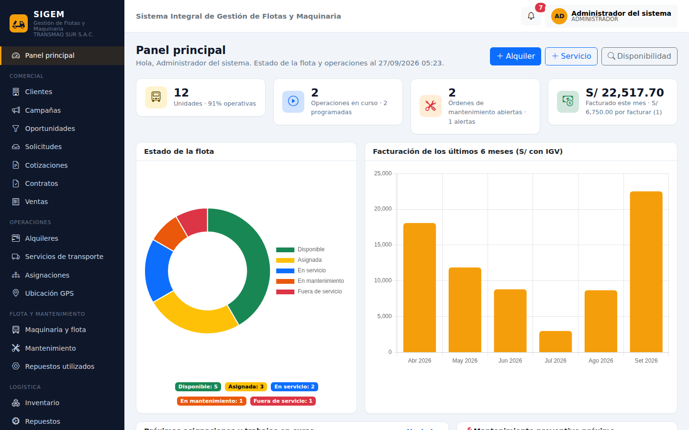

# SIGEM · Sistema Integral de Gestión de Flotas y Maquinaria

Sistema web de **TRANSMAQ SUR S.A.C.** (Arequipa) para gestionar de forma centralizada la
disponibilidad, programación, uso y mantenimiento de su flota de transporte de carga pesada y
maquinaria de alquiler. Reemplaza la coordinación por llamadas, mensajería, cuadernos y hojas de
cálculo sueltas por un único registro compartido por Operaciones, Mantenimiento, Administración,
Comercial y Recursos Humanos.



## Contenido

1. [Módulos](#módulos)
2. [Tecnologías](#tecnologías)
3. [Instalación paso a paso](#instalación-paso-a-paso)
4. [Usuarios de prueba](#usuarios-de-prueba)
5. [Guion de demostración](#guion-de-demostración)
6. [Reglas de negocio](#reglas-de-negocio)
7. [Estructura del proyecto](#estructura-del-proyecto)
8. [API GPS](#api-gps)
9. [Pruebas automatizadas](#pruebas-automatizadas)
10. [Problemas frecuentes](#problemas-frecuentes)

---

## Módulos

| # | Módulo | Qué hace | Menú |
|---|---|---|---|
| 1 | **Usuarios y permisos** | Usuarios, roles y matriz de permisos por módulo (Ver / Gestionar) | Administración → Usuarios, Roles y permisos |
| 2 | **Clientes y contactos** | Constructoras, mineras, gobiernos locales; contactos y ficha 360° del cliente | Comercial → Clientes |
| 3 | **Marketing y oportunidades** | Campañas por canal, embudo de oportunidades por etapa, conversión en solicitud | Comercial → Campañas, Oportunidades |
| 4 | **Maquinaria y flota** | Camiones, volquetes, cisternas, excavadoras, cargadores, retroexcavadoras y compactadoras; estado, lecturas (km/h), tarifas, SOAT y revisión técnica | Flota y mantenimiento → Maquinaria y flota |
| 5 | **Empleados** | Conductores, operadores, técnicos y personal; licencias y su vencimiento | Recursos humanos → Empleados |
| 6 | **Almacenes y repuestos** | Catálogo, stock por almacén, kardex, ajustes y transferencias | Logística → Inventario, Repuestos, Almacenes |
| 7 | **Compras** | Proveedores y órdenes de compra (pendiente → aprobada → recibida ingresa stock) | Logística → Compras, Proveedores |
| 8 | **Solicitudes y cotizaciones** | Requerimientos de clientes y cotizaciones con IGV, versión imprimible | Comercial → Solicitudes, Cotizaciones |
| 9 | **Contratos** | Generación desde cotización aceptada, vigencia, renovación y cierre | Comercial → Contratos |
| 10 | **Ventas** | Facturas y boletas por alquileres/servicios finalizados, repuestos u otros conceptos; pago y anulación | Comercial → Ventas |
| 11 | **Alquileres** | Alquiler de maquinaria por hora o día: programar, iniciar, finalizar y valorizar | Operaciones → Alquileres |
| 12 | **Servicios de transporte / operaciones** | Transporte de carga por km, viaje u hora, con ruta, carga y guía | Operaciones → Servicios de transporte |
| 13 | **Asignación de maquinaria y empleados** | Reserva de unidad + conductor/operador con **control de doble asignación** y consulta de disponibilidad | Operaciones → Asignaciones |
| 14 | **Mantenimiento** | Órdenes preventivas y correctivas; alertas por km/horas; bloqueo de la unidad en taller | Flota y mantenimiento → Mantenimiento |
| 15 | **Repuestos utilizados** | Consumo de repuestos por orden, descontado del almacén y sumado al costo | Flota y mantenimiento → Repuestos utilizados |
| 16 | **Ubicación GPS** | Mapa de la flota, recorridos por día, registro manual, simulador y API para dispositivos | Operaciones → Ubicación GPS |
| 17 | **Notificaciones** | Alertas automáticas (preventivos, stock bajo, contratos, licencias, SOAT…) en la campana | Campana de la barra superior |
| 18 | **Auditoría y trazabilidad** | Registro automático de toda creación/modificación/eliminación con valores anteriores y nuevos, e inicios de sesión | Administración → Auditoría |

Además: **panel principal** con indicadores y gráficos, **reportes** exportables a Excel y PDF,
**Mis tareas** para conductores, operadores y técnicos, y **Mi perfil** para cambiar la contraseña.

## Tecnologías

| Capa | Tecnología |
|---|---|
| Lenguaje | Java 21 |
| Framework | Spring Boot 3.5 (Web MVC, Data JPA, Security, Validation) |
| Vistas | Thymeleaf + Layout Dialect + Thymeleaf Extras Spring Security |
| Estilos y gráficos | Bootstrap 5.3, Bootstrap Icons, Chart.js, Leaflet (incluidos como WebJars: funcionan sin internet) |
| Base de datos | PostgreSQL (administrada con pgAdmin 4) |
| Migraciones | Flyway (crea las tablas automáticamente) |
| Reportes | Apache POI (Excel) y OpenPDF (PDF) |
| Utilidades | Lombok, Spring DevTools |
| Pruebas | JUnit 5, Spring Security Test, H2 en memoria |
| Build | Maven (incluye Maven Wrapper `mvnw`, no necesita instalar Maven) |

## Instalación paso a paso

### 1. Requisitos

- **JDK 21** (por ejemplo [Eclipse Temurin 21](https://adoptium.net/)). Verifique con `java -version`.
- **PostgreSQL 14 o superior** con **pgAdmin 4** (el instalador de PostgreSQL para Windows ya incluye pgAdmin).
  Anote la contraseña que le asigne al usuario `postgres` durante la instalación.
- **Visual Studio Code** con las extensiones *Extension Pack for Java* y *Spring Boot Extension Pack*
  (VS Code las sugiere automáticamente al abrir el proyecto).

### 2. Crear la base de datos en pgAdmin 4

1. Abra pgAdmin 4 y conéctese al servidor *PostgreSQL* (le pedirá la contraseña de `postgres`).
2. Clic derecho en **Databases → Create → Database…**
3. En *Database* escriba `sigem_db` y pulse **Save**.

No hace falta crear tablas: al iniciar el sistema, **Flyway** ejecuta el script
`src/main/resources/db/migration/V1__esquema_inicial.sql` y crea las 30 tablas. Luego podrá verlas en
pgAdmin en *sigem_db → Schemas → public → Tables*.

### 3. Configurar la conexión

Edite `src/main/resources/application.properties` si su usuario o contraseña no son `postgres`:

```properties
spring.datasource.url=${DB_URL:jdbc:postgresql://localhost:5432/sigem_db}
spring.datasource.username=${DB_USER:postgres}
spring.datasource.password=${DB_PASSWORD:postgres}
```

Puede cambiar directamente el valor después de `:` (por ejemplo `${DB_PASSWORD:miClave}`) o definir
las variables de entorno `DB_USER` y `DB_PASSWORD` (también en `.vscode/launch.json`).

### 4. Ejecutar

**Desde VS Code:** abra la carpeta del proyecto, espere a que Java termine de cargar y en la vista
**Spring Boot Dashboard** pulse ▶ sobre `sigem` (o use *Run and Debug → SIGEM (Spring Boot)*).

**Desde la terminal:**

```bash
# Windows
mvnw.cmd spring-boot:run
# Linux / macOS
./mvnw spring-boot:run
```

La primera vez descarga las dependencias (requiere internet unos minutos). Cuando aparezca
`Started SigemApplication`, abra **http://localhost:8080**.

En el primer arranque se crean los roles, el usuario administrador y **datos de demostración**
(12 unidades, 16 empleados, 6 clientes, contratos, operaciones, ventas de los últimos 6 meses,
mantenimientos, inventario y posiciones GPS). Para empezar con la base vacía ponga
`sigem.datos-demo=false` antes del primer inicio.

## Usuarios de prueba

| Usuario | Contraseña | Rol | Qué puede hacer |
|---|---|---|---|
| `admin` | `admin123` | ADMINISTRADOR | Todo |
| `gerente` | `sigem123` | GERENCIA | Consultar todo, reportes y auditoría |
| `operaciones` | `sigem123` | JEFE_OPERACIONES | Flota, alquileres, servicios, asignaciones, GPS |
| `mantenimiento` | `sigem123` | JEFE_MANTENIMIENTO | Mantenimiento, flota, almacenes |
| `tecnico` | `sigem123` | TECNICO | Ejecutar órdenes de mantenimiento |
| `administracion` | `sigem123` | ASISTENTE_ADMINISTRATIVO | Ventas, compras, almacenes, contratos |
| `comercial` | `sigem123` | COORDINADOR_COMERCIAL | Clientes, marketing, solicitudes, cotizaciones, contratos |
| `rrhh` | `sigem123` | RECURSOS_HUMANOS | Empleados |
| `conductor` | `sigem123` | CONDUCTOR_OPERADOR | Mis tareas y reporte de ubicación |
| `operador` | `sigem123` | CONDUCTOR_OPERADOR | Mis tareas y reporte de ubicación |

Los permisos de cada rol se pueden cambiar en **Administración → Roles y permisos**
(aplican en el siguiente inicio de sesión).

## Guion de demostración

Un recorrido de 10 minutos que muestra cómo el sistema resuelve los problemas del caso:

1. **Panel principal** (`admin`): estado de la flota, operaciones en curso, alertas de preventivo,
   stock bajo, contratos por vencer y facturación de 6 meses.
2. **Comercial → Solicitudes**: abra la solicitud de *Ingeniería y Obras Chachani* → **Cotizar** →
   agregue una línea → **Enviar** → **Aceptada** → **Generar contrato**.
3. **Operaciones → Alquileres → Nuevo alquiler**: elija la unidad **EXC-001** para mañana.
   El sistema lo impide: *"La unidad EXC-001 ya está asignada del … (ALQ-00007). No se permite la doble asignación."*
   (Problema: **duplicidad en la asignación**.) Use **Asignaciones → Consultar disponibilidad** para ver qué unidades y operadores están libres.
4. Abra el alquiler en curso **ALQ-00007** → registre la lectura final del horómetro → **Finalizar**:
   calcula las **horas facturables** y el monto. (Problema: **horas/km facturables**.) → **Generar comprobante** → **Emitir**.
5. **Mantenimiento**: la alerta de **EXC-002** muestra el preventivo próximo. Abra **OT-00002 (en proceso)**:
   la unidad está bloqueada, registre un repuesto (se descuenta del almacén) y **Completar**.
   (Problema: **mantenimientos preventivos no controlados**.)
6. **Ubicación GPS** → **Simular reporte** → ver el recorrido de VOL-001.
7. **Reportes → Utilización y rentabilidad de la flota** → exportar a **Excel** y **PDF**.
   (Problema: **pérdida de información histórica**.)
8. **Auditoría**: vea quién hizo cada cambio, con valores anteriores y nuevos.
9. Cierre sesión y entre como `conductor`: solo ve *Mis tareas* y el reporte de ubicación.

## Reglas de negocio

- **Sin doble asignación:** una unidad, o un conductor/operador, no puede tener dos asignaciones
  (programadas o en curso) que se crucen en el tiempo. Tampoco se asigna una unidad con mantenimiento
  programado en esas fechas, fuera de servicio o con el conductor con licencia vencida.
- **Estado de la unidad calculado automáticamente:** *En mantenimiento* (orden en proceso) › *En servicio*
  (trabajo en curso) › *Asignada* (trabajo programado) › *Disponible*. *Fuera de servicio* es manual.
- **Valorización:** al finalizar un alquiler o servicio se calcula la cantidad facturable según la modalidad:
  por hora (diferencia del horómetro en maquinaria, tiempo real en vehículos), por día (días calendario),
  por km (diferencia del odómetro) o por viaje. Monto = cantidad × tarifa (sin IGV).
- **Lecturas:** el odómetro/horómetro nunca retrocede; la lectura final no puede ser menor a la inicial.
- **Mantenimiento preventivo:** se alerta al 90 % del intervalo (km u horas) y al completar un preventivo
  se reinicia el contador. Una unidad en taller no puede iniciar trabajos y no se programa el taller en
  días con asignaciones (salvo prioridad crítica).
- **Inventario:** todo movimiento queda en el kardex; no se permite stock negativo; al bajar del mínimo
  se notifica a Compras y Almacén. Recibir una compra ingresa el stock y actualiza el último costo.
- **Facturación:** IGV 18 %. La factura exige cliente con RUC. Una operación solo se factura una vez;
  anular el comprobante devuelve repuestos al almacén y libera la operación para refacturar.
  Los correlativos (F001-, B001-) se asignan al emitir.
- **Contratos:** una cotización aceptada genera un solo contrato; las operaciones deben estar dentro de
  la vigencia; la renovación crea un contrato nuevo enlazado. Los vencidos se finalizan automáticamente.
- **Alertas automáticas** (al iniciar y cada hora): preventivos próximos o vencidos, stock bajo mínimo,
  contratos por vencer (30 días), licencias y SOAT/revisión técnica por vencer, cotizaciones vencidas.
- **Auditoría:** toda creación, modificación (con valores antes → después) y eliminación se registra
  automáticamente con usuario, fecha e IP; también los inicios de sesión exitosos y fallidos.

## Estructura del proyecto

```
src/main/java/com/transmaqsur/sigem/
├── SigemApplication.java          Punto de entrada
├── model/                         Entidades JPA (tablas) y enums/ (estados y tipos)
├── repository/                    Acceso a datos (Spring Data JPA)
├── service/                       Reglas de negocio (una clase por módulo)
├── controller/                    Controladores web (pantallas) y utilidades de vista
├── api/                           API REST para dispositivos GPS
├── security/                      Login, roles y permisos por módulo
├── audit/                         Auditoría automática (listeners de Hibernate)
├── reporte/                       Reportes y exportación a Excel/PDF
├── config/                        Configuración y datos iniciales/de demostración
├── exception/                     Errores de negocio
└── util/                          Cálculos de montos e IGV
src/main/resources/
├── application.properties         Configuración (base de datos, empresa, GPS)
├── db/migration/                  Scripts Flyway (esquema de la base de datos)
├── templates/                     Vistas Thymeleaf por módulo
└── static/                        CSS, JavaScript e imágenes
docs/                              Modelo de datos y capturas de pantalla
```

Arquitectura MVC por capas: **controller → service → repository → base de datos**. Las reglas de
negocio están solo en los servicios; los controladores reciben formularios y muestran resultados.

## API GPS

Los dispositivos GPS o una app móvil pueden reportar posiciones:

```bash
curl -X POST http://localhost:8080/api/gps \
  -H "X-API-KEY: transmaq-gps-2026" -H "Content-Type: application/json" \
  -d '{"codigoUnidad":"VOL-001","latitud":-16.39,"longitud":-71.54,"velocidad":45,"referencia":"Uchumayo"}'
```

`GET /api/gps/ultimas` (con la misma cabecera) devuelve la última posición de cada unidad.
La clave se configura en `sigem.gps.api-key`.

## Pruebas automatizadas

```bash
./mvnw test        # Windows: mvnw.cmd test
```

Usan una base H2 en memoria (no necesitan PostgreSQL) y verifican: doble asignación de unidades y
personal, ciclo completo de alquiler con cálculo de horas y facturación, días calendario, lecturas,
mantenimiento con consumo de repuestos y bloqueo de la unidad, compra que ingresa stock,
solicitud → cotización → contrato → renovación, factura con RUC, auditoría y control de acceso por permisos.

## Problemas frecuentes

| Problema | Solución |
|---|---|
| `password authentication failed for user "postgres"` | La contraseña en `application.properties` no coincide con la de PostgreSQL. |
| `database "sigem_db" does not exist` | Cree la base en pgAdmin (paso 2). |
| `Connection refused` a `localhost:5432` | El servicio de PostgreSQL no está iniciado (Windows: *Servicios → postgresql-x64*). |
| `Port 8080 was already in use` | Cierre la otra aplicación o cambie `server.port` en `application.properties`. |
| VS Code no reconoce Lombok (errores en getters) | Instale *Extension Pack for Java* y recargue la ventana. |
| Quiero volver a los datos de demostración | En pgAdmin elimine y vuelva a crear `sigem_db`; al iniciar se recargan. |
| El mapa GPS se ve gris | Los mapas de OpenStreetMap requieren internet; el resto del sistema funciona sin conexión. |

---

Proyecto académico desarrollado a partir del caso de estudio de TRANSMAQ SUR S.A.C. (Arequipa, Perú).
