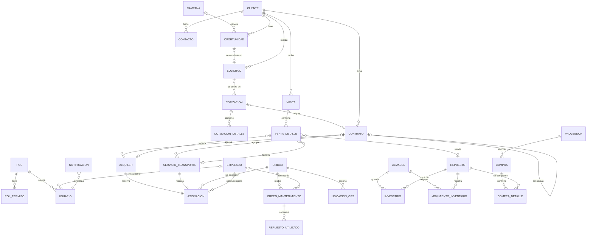

# Modelo de datos de SIGEM

La base de datos PostgreSQL tiene **30 tablas**, creadas automáticamente por Flyway con el
script [`V1__esquema_inicial.sql`](../src/main/resources/db/migration/V1__esquema_inicial.sql).
Todas las tablas de negocio incluyen los campos de trazabilidad `fecha_creacion`, `creado_por`,
`fecha_modificacion` y `modificado_por`.

## Diagrama entidad-relación (principal)

La tabla `AUDITORIA` no tiene llaves foráneas a propósito: guarda el nombre de la entidad y su id
para conservar el historial aunque el registro original se elimine.

## Tablas por módulo

| Módulo | Tablas |
|---|---|
| Usuarios y permisos | `rol`, `rol_permiso`, `usuario` |
| Clientes y contactos | `cliente`, `contacto` |
| Marketing y oportunidades | `campana`, `oportunidad` |
| Maquinaria y flota | `unidad` |
| Empleados | `empleado` |
| Almacenes y repuestos | `almacen`, `repuesto`, `inventario`, `movimiento_inventario` |
| Compras | `proveedor`, `compra`, `compra_detalle` |
| Solicitudes y cotizaciones | `solicitud`, `cotizacion`, `cotizacion_detalle` |
| Contratos | `contrato` |
| Ventas | `venta`, `venta_detalle` |
| Alquileres | `alquiler` |
| Servicios de transporte | `servicio_transporte` |
| Asignación de maquinaria y empleados | `asignacion` |
| Mantenimiento | `orden_mantenimiento` |
| Repuestos utilizados | `repuesto_utilizado` |
| Ubicación GPS | `ubicacion_gps` |
| Notificaciones | `notificacion` |
| Auditoría y trazabilidad | `auditoria` |

## Estados principales

| Entidad | Estados |
|---|---|
| Unidad | DISPONIBLE → ASIGNADA → EN_SERVICIO → DISPONIBLE · EN_MANTENIMIENTO · FUERA_SERVICIO |
| Solicitud | REGISTRADA → COTIZADA → APROBADA → ATENDIDA · RECHAZADA · ANULADA |
| Cotización | BORRADOR → ENVIADA → ACEPTADA · RECHAZADA · VENCIDA |
| Contrato | VIGENTE → FINALIZADO · RENOVADO · ANULADO |
| Alquiler / servicio | PROGRAMADO → EN_CURSO → FINALIZADO · ANULADO |
| Asignación | PROGRAMADA → EN_CURSO → FINALIZADA · CANCELADA |
| Orden de mantenimiento | PROGRAMADA → EN_PROCESO → COMPLETADA · CANCELADA |
| Compra | PENDIENTE → APROBADA → RECIBIDA · ANULADA |
| Venta | BORRADOR → EMITIDA → PAGADA · ANULADA |

El estado de la **unidad** no se edita a mano: el sistema lo calcula a partir de sus asignaciones y
órdenes de mantenimiento (mantenimiento en proceso > en servicio > asignada > disponible).
